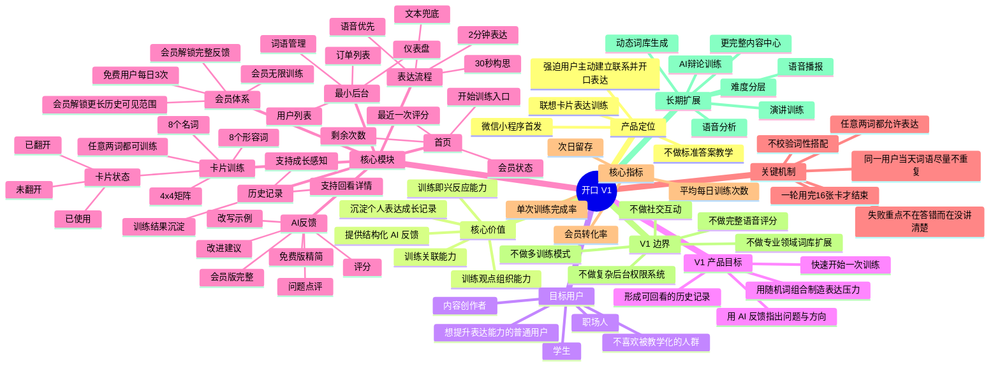
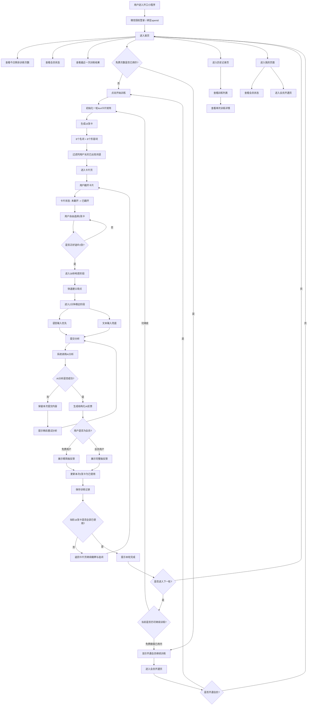

# 开口｜产品规划思维导图与 App 逻辑流程图

这份内容适合直接作为文章配图底稿使用。

- 图 1：适合讲产品定位、范围、价值和长期规划
- 图 2：适合讲用户在小程序里的主链路和关键决策点

---

## 图 1｜产品规划思维导图

---

## 图 2｜App 逻辑设计流程图

---

## 文章里可以直接配的标题

- 《开口：一个用联想卡片训练表达能力的小程序，是怎么设计出来的？》
- 《从 4×4 词卡到 AI 反馈，我做了一个表达训练产品》
- 《如果表达能力也能像刷题一样练，会是什么样子？》

## 如果你要继续发文章

下一步我可以继续直接给你补两类内容：

1. 一版“适合公众号排版”的图文版说明
2. 一版“更像创始人产品思考”的文章大纲
